# VANTAGE — System Architecture

*Autonomous Transaction Intelligence for the Monad Ecosystem*

This document is a read-only trace of the actual implementation. Every claim below is
derived from the source files listed in the final section — no assumptions, no
aspirations. All diagrams are Mermaid.

---

## Section 1 — High-Level Overview

**What problem does VANTAGE solve?**

Modern wallets answer one question: *"Will this transaction probably execute?"* VANTAGE
answers a more useful one: *"Should this transaction be executed right now?"* Between the
moment a transaction is simulated and the moment it is signed, the chain can change:
liquidity moves, contract state updates, execution contention rises, approvals expose
unnecessary token permissions, and transactions can silently fail after appearing to be
accepted. VANTAGE continuously re-evaluates these execution conditions and converts them
into an explainable, deterministic recommendation — PROCEED, WARN, HOLD_AND_RECHECK,
SUGGEST_ADJUSTMENT, or ABORT — before the user commits to signing (`backend/src/apa/policy.ts`,
`backend/src/routes/evaluate.ts`).

**Why is Monad's execution model different?**

Monad uses optimistic parallel execution with a deferred execution model and an
asynchronous transaction lifecycle. Multiple transactions execute in parallel under
optimistic concurrency control (OCC) and are re-executed when they conflict, so a
transaction's observable outcome depends on what else is racing it — not just on the
state it was simulated against. This is stated in the project README and reflected in the
implementation: the Execution Conflict Analyzer (ECA) exists precisely because
"naive polling" and single-snapshot simulation cannot see the competing pending
transactions that Monad's parallelism makes relevant (`backend/src/psg/forecast.ts` — ECA
section), and the transaction watcher must disambiguate "propagating", "stuck", and
"dropped" states that all look identical to a naive null-receipt check
(`backend/src/apa/policy.ts` — `classifyTx`, `watchTransaction`).

**Why are traditional wallet flows insufficient?**

Traditional wallet flows capture a single snapshot at sign time. They have no model of
*state drift* (the price the user was quoted vs. the price they will get), *contention*
(how busy the target contract is right now), *execution conflict* (who else is racing the
same contract or slot in the mempool), *approval exposure* (unbounded token allowances),
or *post-submission reality* (did it actually confirm, fail, drop, or get stuck?). Each of
these is a module in VANTAGE's pipeline rather than an assumption.

**What architectural gap is VANTAGE filling?**

The gap is *continuous, evidence-backed execution intelligence with a policy layer on
top*. VANTAGE is organized as deterministic analysis (PSGS: forecast, validity,
contention, ECA, approval exposure) feeding an explainable policy agent (APA:
`decidePolicy`, `holdAndRecheck`, `applyWatchdogBias`), with an audit ledger, a
background watchdog, a feedback-driven calibrator, and a transparent contract score. AI is
constrained to one labelled job — turning deterministic signals into a plain-English
sentence (`explainPolicy` in `policy.ts`, with a deterministic fallback template). AI never
simulates, scores, inspects state, or computes risk.

---

## Section 2 — Complete System Architecture

The end-to-end pipeline, as implemented:

```mermaid
flowchart TD
    W["Wallet (frontend)<br/>useTxBuilder builds tx + live quote<br/>frontend/src/hooks/useTxBuilder.ts"]
    W -->|POST /api/evaluate| EV

    subgraph PSGS["Pre-Sign Guard System (PSGS) — backend/src/psg/forecast.ts"]
        SIM["Simulation — getForecast()<br/>eth_call / simulateContract, gas estimate"]
        ECA["Execution Conflict Analyzer — scanConflict()<br/>analyzePendingTxs() / logs-fallback"]
        DRIFT["Drift Analysis — computeDriftPercent()<br/>signed (simulated − quoted)/quoted"]
        NV["Nonce Validation — checkValidity()<br/>pending nonce + balance vs gas"]
        AA["Approval Analysis — checkApprovalExposure()<br/>approve() calldata ≥ 50% of balance"]
        CONT["Contention — getContentionScore()<br/>log density over ~3 min window"]
    end

    EV["evaluate() route — backend/src/routes/evaluate.ts<br/>getPSGForecast() runs the five modules in parallel"] --> PSGS

    PSGS -->|PSGForecast: simulationSuccess, outputDriftPercent,<br/>nonceCurrent/Issue, balanceSufficient, contentionScore,<br/>conflictScore/Flags/Evidence, flags[], riskLevel| RISK

    RISK["Risk Scoring — deriveRiskLevel()<br/>backend/src/psg/forecast.ts"]
    RISK -->|riskLevel: LOW / MEDIUM / HIGH / CRITICAL| POL

    POL["Policy Engine — decidePolicy()<br/>backend/src/apa/policy.ts"]
    POL -->|initial action| HOLD{"action ==<br/>HOLD_AND_RECHECK?"}
    HOLD -->|yes| HR["holdAndRecheck()<br/>re-poll getPSGForecast every 3s,<br/>timeout 30s → SUGGEST_ADJUSTMENT"]
    HOLD -->|no| WB
    HR --> WB
    WB["applyWatchdogBias()<br/>critical alerts → PROCEED becomes WARN"]
    WB -->|final PolicyResult| LEDGER

    LEDGER["Ledger Persistence — recordEntry()<br/>backend/src/em/ledger.ts<br/>execution_ledger row (forecast_json + policy + explanation)"]
    LEDGER -->|entryId| RESP

    RESP["Response serialization<br/>forecast (+ score), policy, explanation, entryId"]
    RESP --> FE["Frontend — VerdictPanel<br/>frontend/src/components/guard/verdict-panel.tsx"]

    LEDGER -.->|entryId, 10s poll| RC["Recheck Loop — POST /api/recheck<br/>backend/src/routes/recheck.ts → getPSGForecast → decidePolicy"]
    RC -->|partial forecast + policy| FE
```

**Stage-by-stage detail** (source files, functions, inputs, outputs, produced/consumed flags):

| Stage | Source file | Functions | Inputs | Outputs | Produced flags | Consumed flags |
|---|---|---|---|---|---|---|
| Simulation | `backend/src/psg/forecast.ts` | `getForecast`, `safeCall`, `decodeRevertReason` | `VantageTxRequest`, `quotedOutput?` | `simulationSuccess`, `simulatedOutput`, `revertReason`, `gasEstimate` | — | — |
| ECA | `backend/src/psg/forecast.ts` | `scanConflict`, `analyzePendingTxs`, `fallbackConflict` | `VantageTxRequest`, pending-block txs | `conflictScore`, `conflictFlags`, `conflictEvidence` | `POTENTIAL_STATE_CONFLICT`, `HIGH_STATE_CONFLICT` | — |
| Drift | `backend/src/psg/forecast.ts` | `computeDriftPercent` | simulated output, quoted output | `outputDriftPercent` (signed %) | `STALE_STATE` (drift < −5%) | — |
| Nonce / balance | `backend/src/psg/forecast.ts` | `checkValidity` | `VantageTxRequest`, pending nonce, balance, gas price | `nonceCurrent`, `nonceIssue`, `balanceSufficient` | `NONCE_STALE`, `NONCE_GAP`, `LOW_BALANCE` | — |
| Contention | `backend/src/psg/forecast.ts` | `getContentionScore`, `getLogsChunked`, `estimateBlockTime`, `contentionWindowFromBlock` | target address, `eth_getLogs` over ~3 min window | `contentionScore` (0–1, `min(logs/20, 1)`) | `HIGH_CONTENTION` (≥ 0.3) | — |
| Approval | `backend/src/psg/forecast.ts` | `checkApprovalExposure` | `VantageTxRequest`, ERC-20 `balanceOf` | boolean exposure | `APPROVAL_EXPOSURE` | — |
| Risk scoring | `backend/src/psg/forecast.ts` | `deriveRiskLevel` | `flags[]`, `contentionScore`, calibrated hold threshold | `riskLevel` (LOW/MEDIUM/HIGH/CRITICAL) | — | all flags above |
| Policy | `backend/src/apa/policy.ts` | `decidePolicy`, `applyWatchdogBias`, `holdAndRecheck` | forecast, active critical alert count | `PolicyResult` (action, reason, suggestedAdjustment) | `WATCHDOG_CRITICAL_ALERTS` (pushed by route) | `riskLevel`, all flags |
| Ledger | `backend/src/em/ledger.ts` | `recordEntry`, `updateOutcome`, `getRecentEntries`, `getSessionStats` | forecast, policy, explanation | `entryId`, immutable audit row | — | — |
| Recheck | `backend/src/routes/recheck.ts` | route handler → `getPSGForecast` → `decidePolicy` → `applyWatchdogBias` | `entryId`, original `quotedOutput` from stored `forecast_json` | partial forecast + policy | same flags, re-derived | — |
| Frontend | `frontend/src/routes/app.tsx`, `frontend/src/components/guard/verdict-panel.tsx` | `useVerdictRecheck` (10s poll), guarded merge effect, `VerdictPanel` | `EvaluateResponse` + `RecheckResult` | rendered verdict cards | — | all flags (chips, tones, status) |

---

## Section 3 — Request Flow (`/api/evaluate`)

```mermaid
sequenceDiagram
    participant U as User
    participant B as useTxBuilder (frontend)
    participant E as POST /api/evaluate (backend)
    participant F as getPSGForecast (PSGS)
    participant P as decidePolicy / APA
    participant L as Execution Memory (SQLite)
    participant V as VerdictPanel (frontend)

    U->>B: choose preset, amount, direction
    B->>B: getTransactionCount(pending) → nonce; readContract(getExpectedOutput) → quotedOutput; encodeFunctionData → data
    B->>E: POST /api/evaluate { tx: {from,to,data,value,nonce}, quotedOutput }
    E->>F: getPSGForecast(tx, quotedOutput)
    par parallel modules
        F->>F: getForecast (simulate + gas estimate + drift vs quote)
        F->>F: checkValidity (pending nonce + balance)
        F->>F: getContentionScore (log density, 3 min window)
        F->>F: checkApprovalExposure (approve calldata vs balance)
        F->>F: scanConflict (pending block → ECA)
    end
    F-->>E: PSGForecast (riskLevel, flags, conflict fields)
    E->>P: decidePolicy(forecast)
    alt action == HOLD_AND_RECHECK
        P->>P: holdAndRecheck — re-poll up to 30s (interval 3s)
        P-->>E: final policy + the forecast it was derived from
    end
    E->>P: applyWatchdogBias(policy, activeCriticalAlerts)
    E->>E: explainPolicy (Gemini or deterministic template fallback)
    E->>L: recordEntry(forecast, policy, explanation) → entryId
    E->>L: addToWatchlist(tx.to, "auto")
    E->>L: computeScore(tx.to, contentionScore) → score
    E-->>V: { forecast: {...forecast, score}, policy, explanation, entryId }
    V->>V: render VerdictPanel (drift card, ECA card, fields, flags, score)
```

Notes from the implementation:

- The frontend **never** computes drift, risk, or conflict — it builds the transaction,
  quotes the pool live, and renders the backend's answer (`useTxBuilder.ts`).
- `quotedOutput` is the live `getExpectedOutput` read, which is what makes the drift check
  meaningful: the backend compares its own simulation against that quote
  (`useTxBuilder.ts`, `forecast.ts`).
- If the policy resolves to HOLD_AND_RECHECK, the backend keeps polling internally (3s
  interval, 30s timeout) and returns the policy *and the forecast it was derived from*,
  so the audit row never pairs a fresh decision with stale evidence (`policy.ts` —
  `HoldRecheckResult.forecast`).
- Response serialization spreads the full forecast plus `score` (`evaluate.ts`).

---

## Section 4 — Simulation Engine

```mermaid
sequenceDiagram
    participant R as Route (evaluate/recheck)
    participant G as getForecast (forecast.ts)
    participant C as Public RPC (Monad testnet)
    participant D as decodeRevertReason

    R->>G: getForecast(tx, quotedOutput?)
    G->>C: estimateGas({to, data, value, account})
    C-->>G: gasEstimate (or null on failure)

    alt tx.to in KNOWN_CONTRACTS (AMM | ClaimContract)
        G->>G: decodeFunctionData(abi, data)
        G->>C: simulateContract(functionName, args, account, value)
        C-->>G: result / revert
        alt functionName == "swap"
            G->>C: simulateContract(getExpectedOutput, [swapInput, inputIsToken])
            Note over G: swapInput = inputIsToken ? inputAmount : tx.value<br/>(MON→token spends msg.value, not inputAmount)
            G->>G: simulatedOutput = expectedOut; drift vs quotedOutput
        else resultValue defined
            G->>G: simulatedOutput = resultValue; drift vs quotedOutput
        end
    else generic contract
        G->>C: eth_call with account=tx.from (NOT from — viem drops `from`)
        C-->>G: return data (first 32-byte word decoded as output) or revert
    end

    C-->>G: revert error
    G->>D: decodeRevertReason(err)
    D-->>G: human-readable reason (custom selectors, Error(string), Panic codes, unknown selector)
    G-->>R: PSGForecast (simulationSuccess, simulatedOutput, revertReason, gasEstimate, outputDriftPercent)
```

- **Entry point**: `getForecast(tx, quotedOutput)` in `backend/src/psg/forecast.ts`.
- **Transaction construction**: happens on the frontend (`useTxBuilder.ts`) — `encodeFunctionData`
  against the AMM / ClaimContract / ERC-20 ABIs; the nonce comes from
  `getTransactionCount({blockTag: "pending"})` so the evaluated nonce matches what the
  wallet will sign.
- **RPC calls**: `estimateGas`, `simulateContract` (known contracts), raw `eth_call`
  (generic), all via a cached `createPublicClient` over `RPC_URL`
  (default `https://testnet-rpc.monad.xyz`, chain id 10143, `config.ts`).
- **Quoted output**: the user-facing number, read live from the pool
  (`getExpectedOutput`) by `useTxBuilder` and passed to the backend.
- **Simulated output**: what the chain currently returns (`simulateContract` result for
  known contracts; first 32-byte word of the raw call for generic contracts — the whole
  blob is deliberately *not* converted, see the comment in `getForecast`).
- **Failure handling**: any failure path returns a forecast with
  `simulationSuccess: false` and a decoded `revertReason` (custom selectors for the
  deployed contracts, `Error(string)`, Solidity panic codes, or an unknown-selector
  string). `REVERT` flag → CRITICAL risk → ABORT.

---

## Section 5 — Execution Conflict Analyzer (ECA)

The ECA is a **contract-level** estimator — explicitly *not* storage-slot tracing, *not*
OCC reconstruction, and *never* a claim of true conflict detection (comment in
`forecast.ts`). It answers: *who else in the mempool is racing the same contract or slot?*

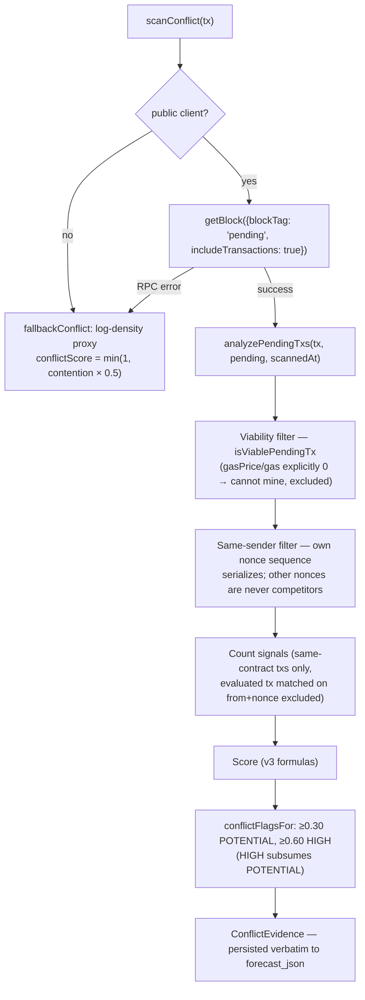

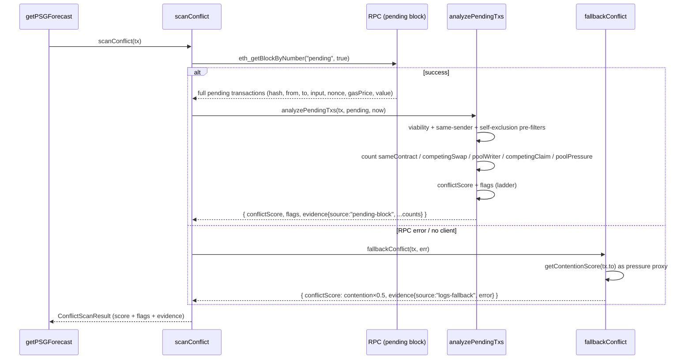

### The implemented v3 formulas (exact)

From `backend/src/psg/forecast.ts` (constants) and `backend/src/psg/conflict.test.ts`
(pinned values):

```
g(n, k) = n / (n + k)                              // diminishing returns, never saturates

sameContractScore   = g(competingTxCount, 2)                       weight 0.08
directConflictScore = g(swaps + 0.5·poolWriters, 1)                weight 0.86   (evaluated tx is a swap)
                      g(sameSlotClaims, 0.5)                       weight 0.86   (evaluated tx is a claim)
poolPressureScore   = g(pendingPoolSize, 250)                      weight 0.06

conflictScore = min(1, round(0.08·sameContractScore
                            + 0.86·directConflictScore
                            + 0.06·poolPressureScore, 3 decimals))
```

**Flags** (severity ladder in `conflictFlagsFor`):

```
conflictScore >= 0.60  → ["HIGH_STATE_CONFLICT"]        (HIGH subsumes POTENTIAL)
conflictScore >= 0.30  → ["POTENTIAL_STATE_CONFLICT"]
otherwise              → []
```

Constants: `ECA_SAME_CONTRACT_WEIGHT = 0.08`, `ECA_DIRECT_CONFLICT_WEIGHT = 0.86`,
`ECA_POOL_PRESSURE_WEIGHT = 0.06`, `ECA_SAME_CONTRACT_K = 2`, `ECA_DIRECT_K = 1`,
`ECA_CLAIM_DIRECT_K = 0.5`, `ECA_POOL_PRESSURE_K = 250`,
`ECA_POOL_WRITER_FACTOR = 0.5`, `ECA_POTENTIAL_THRESHOLD = 0.3`,
`ECA_HIGH_THRESHOLD = 0.6`, `ECA_EVIDENCE_TX_CAP = 20`,
`ECA_FALLBACK_CONTENTION_FACTOR = 0.5`.

**Detection stages** (each count is pre-filtered before it becomes evidence):

- **Pending block enumeration** — `scanConflict` reads `eth_getBlockByNumber("pending",
  true)`, the only mempool primitive the public Monad RPC exposes (the Stage 0 probe
  showed `txpool_content`/`txpool_inspect` return `-32601`).
- **Viability filtering** — `isViablePendingTx`: an explicit `gasPrice` 0 or `gas` 0
  (a Monad mempool artifact) marks a tx that cannot mine; it is excluded from every count
  and from pool pressure. Missing fields are treated as viable.
- **Same-sender filtering** — a sender's own nonce sequence serializes deterministically,
  so other-nonce txs from the same sender are excluded as `excludedSameSenderCount`
  (never competitors).
- **Self-exclusion** — the evaluated tx itself (matched on `from + nonce`) is never
  counted, so a recheck of an already-submitted tx doesn't count itself.
- **Swap detection** — pending `swap()` calls on the AMM count as `competingSwapCount`
  (full-weight direct conflicts) when the evaluated tx is a swap.
- **Pool writer detection** — pending non-swap AMM reserve movers (decoded from the AMM
  ABI's payable/nonpayable functions) count as `competingPoolWriterCount` at half weight
  (`ECA_POOL_WRITER_FACTOR = 0.5`).
- **Same-slot claim detection** — pending `claim(slotId)` calls for the *same* slot count
  as `competingClaimCount` (winner-take-all curve k = 0.5: one claim → HIGH).
- **Pool-pressure detection** — viable pending txs chain-wide (`pendingPoolSize`) feed the
  slow background `poolPressureScore` (k = 250).

**Conflict evidence** (`ConflictEvidence` type): `source` (`"pending-block"` |
`"logs-fallback"`), `scannedAt`, `competingTxCount`, `competingSwapCount`,
`competingPoolWriterCount`, `competingClaimCount`, `pendingPoolSize`,
`excludedSameSenderCount`, `excludedNonViableCount`, a bounded `relevantTxs` snapshot
(cap 20), and `error?`. Persisted verbatim into `forecast_json` so every audit row carries
the evidence that produced the score.

**Recalibration (v3)** — audit-driven constant rebalance, no signals added or removed, no
threshold change: direct weight 0.80 → 0.86; same-contract weight 0.14 → 0.08 with curve
k 1 → 2; claim curve k 0.4 → 0.5; pool curve k 300 → 250. Policy anchors survive: one
direct competitor → POTENTIAL, two → HIGH, a single same-slot claim → HIGH, ambient-only
pressure never flags. Ambient same-contract + pool pressure alone max out at
0.08 + 0.06 = 0.14, below the 0.30 POTENTIAL floor.

**Fallback mode** — when the pending block is unavailable (RPC error or no client),
`fallbackConflict` reuses `getContentionScore` as a pressure proxy, halved
(`contention × 0.5 ≤ 0.5`), so `HIGH_STATE_CONFLICT` is never claimed without mempool
evidence. The evidence records `source: "logs-fallback"` plus the error.

---

## Section 6 — Drift Analysis

- **Function**: `computeDriftPercent(simulated, quoted)` in `backend/src/psg/forecast.ts`:
  `(simulated − quoted) × 10_000 / quoted / 100` — a **signed** percentage.
- **quotedOutput**: the price the user was shown (live `getExpectedOutput` read at build
  time by `useTxBuilder`). For a recheck, the *original* quote is read back from the
  stored `forecast_json` (`recheck.ts`), so a pool move shows up as a real number instead
  of being re-baselined away.
- **simulatedOutput**: what the chain currently returns (see Section 4).
- **STALE_STATE generation**: in `getPSGForecast`,
  `outputDriftPercent !== null && outputDriftPercent < −5` → flag `STALE_STATE`.
  Positive drift is *better* than quoted; only drift worse than −5% flags.
- **Thresholds**: the −5% constant lives inline in `getPSGForecast`. There is no separate
  drift-threshold constant.

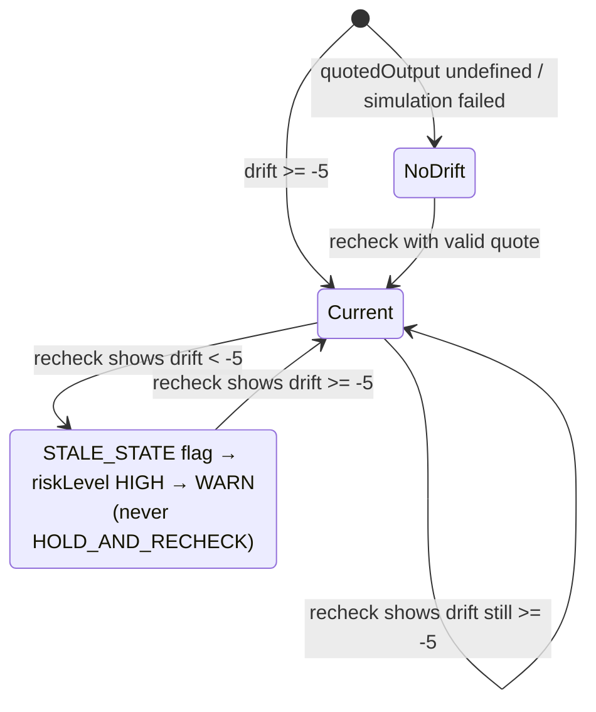

**Why STALE_STATE maps to WARN rather than HOLD_AND_RECHECK** — this is documented in the
`decidePolicy` source comment: the hold loop exists for conditions that resolve by
*waiting* (contention settles). A stale quote is a fixed reference vs. the current pool
price, so waiting cannot fix it — and the hold timeout's "try increasing gas" advice would
be actively wrong for a price move. The live `/api/recheck` verdict already surfaces the
drift without a server-side wait, so WARN stays the actionable state. Contention still
outranks STALE_STATE (checked earlier in the ladder), preserving HOLD behavior when both
are present.

---

## Section 7 — Nonce Validation

- **Function**: `checkValidity(tx)` in `backend/src/psg/forecast.ts`.
- **Account nonce retrieval**: `getTransactionCount({address, blockTag: "pending"})` — the
  pending count, because that is what the wallet will sign against.
- **Validation** (three-way):

```
tx.nonce <  pendingNonce  → nonceCurrent=false, nonceIssue="STALE"   (already used)
tx.nonce == pendingNonce  → nonceCurrent=true,  nonceIssue=null      (ready)
tx.nonce >  pendingNonce  → nonceCurrent=false, nonceIssue="GAP"     (prior nonces must land)
```

- **Balance**: `getBalance` + `getGasPrice` + `estimateGas` (fallback budget 100,000 gas)
  → `balanceSufficient = balance >= gasCost + tx.value`.
- **Flag generation** (`getPSGForecast`): `balanceSufficient === false` → `LOW_BALANCE`;
  `nonceCurrent === false` with `nonceIssue === "STALE"` → `NONCE_STALE`, else `NONCE_GAP`.
  All three push `riskLevel` to HIGH.

**Why nonce violations always ABORT** — `decidePolicy`'s HIGH branch checks
`NONCE_GAP || NONCE_STALE || LOW_BALANCE` *before* HIGH_CONTENTION and
HIGH_STATE_CONFLICT. The comment explains: an invalid nonce must never be downgraded to
HOLD_AND_RECHECK merely because HIGH_CONTENTION is also present — holding cannot fix a
nonce that is stale or gapped, and the hold path could time out into SUGGEST_ADJUSTMENT
for a transaction that can never mine.

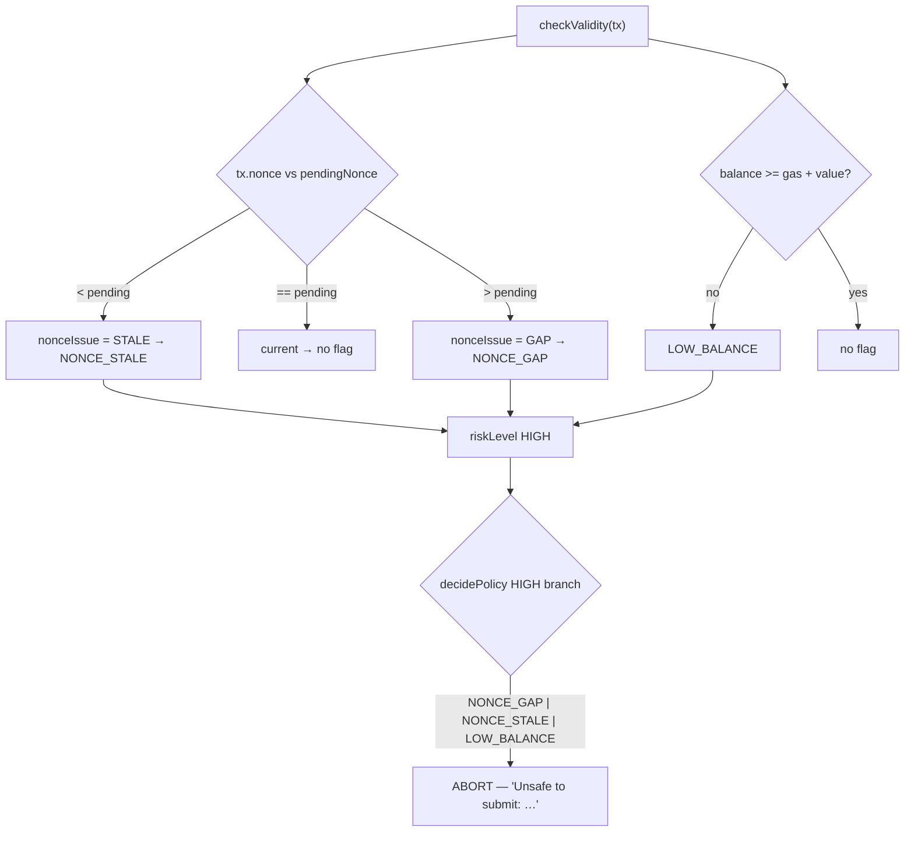

---

## Section 8 — Approval Analysis

- **ERC-20 approval inspection**: `checkApprovalExposure(tx)` in
  `backend/src/psg/forecast.ts` decodes calldata against a minimal `approve(address,
  uint256)` ABI (`erc20ApproveAbi`).
- **Unlimited approval detection**: any `approve()` call whose `amount` is ≥ 50% of the
  sender's balance (the *same ≥ 0.5 ratio* the watchdog's `checkApprovalExposure` uses)
  raises the `APPROVAL_EXPOSURE` flag. An `amount` of `maxUint256` — the "Unlimited
  approval" preset (`useTxBuilder.ts` encodes `maxUint256`) — trivially satisfies this.
- **Oversized approval detection**: the flag fires for any approve ≥ half the balance;
  there is no separate "unlimited" vs "oversized" split — the two are the same signal at
  different magnitudes.
- **Severity mapping**: `APPROVAL_EXPOSURE` → `riskLevel MEDIUM` → policy `WARN`
  ("caution, not a stop" — the same severity as the watchdog's `approval_exposure`
  warning).
- **Generated warnings**: the flag renders as a chip in the VerdictPanel
  (`flagDescription`: "granting a contract unbounded access to your tokens"), and the
  MEDIUM risk level produces the WARN decision with its flags in the reason. The Guard
  console's "Unlimited approval" preset exercises this module synchronously in
  `/api/evaluate`, not only via the background watchdog poll.
- **Edge cases** (from the source): non-approve calldata → no flag; `balanceOf` = 0 →
  no flag ("nothing exposed to compare against"); any error → no flag. Never throws.

---

## Section 9 — Risk Scoring

- **Function**: `deriveRiskLevel(flags, contentionScore, holdThreshold)` in
  `backend/src/psg/forecast.ts` (default hold threshold `0.7` from `calibrator.ts`).

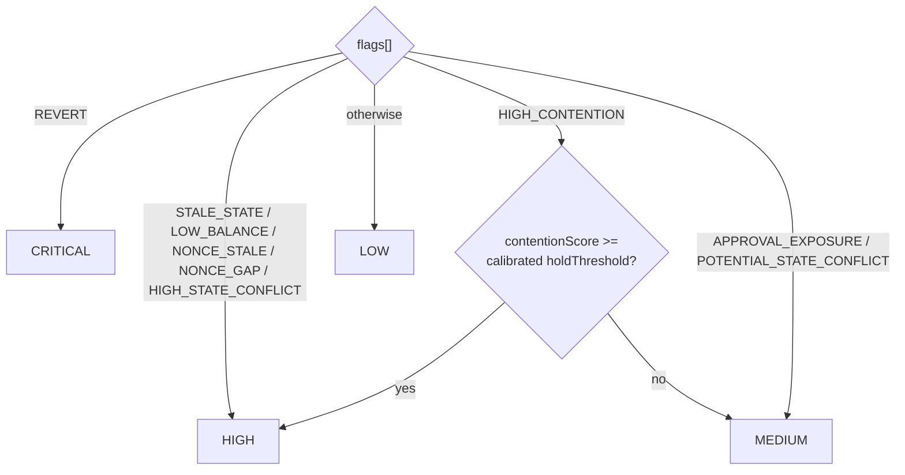

- **Risk levels**: `LOW`, `MEDIUM`, `HIGH`, `CRITICAL` (typed union in `forecast.ts`).
- **Risk aggregation**: a single risk level is derived from the *set* of flags, not
  summed. Each module contributes flags (Sections 4–8); `deriveRiskLevel` maps flag sets
  to one level; `decidePolicy` maps level+flags to an action.
- **Historical calibration**: the HOLD threshold is per-contract and persisted in the
  `contention_thresholds` table (`em/ledger.ts`, `em/schema.sql`). `recalibrate`
  (`em/calibrator.ts`) re-derives it from real history after every reported outcome
  (`POST /api/outcome`): failure rate > 40% → lower threshold 10% (more sensitive);
  failure rate < 10% with ≥ 20 samples → raise 5%; clamped to [0.3, 0.95]. The watchdog
  also recalibrates on failure surges, throttled by a 5-minute cooldown
  (`services/watchdog.ts`).
- **Threshold calibration flow**: outcome reported → `recalibrate(entry.tx_to)` →
  upsert `hold_threshold` → next `deriveRiskLevel` uses the new value.

---

## Section 10 — Policy Engine (`decidePolicy`)

Pure function in `backend/src/apa/policy.ts`: reads `riskLevel`, `flags[]`,
`revertReason`, `outputDriftPercent`, `contentionScore`, `conflictScore` from a
`PSGForecast` and returns `{ action, reason, suggestedAdjustment? }`. Never throws.

**Exact precedence ladder** (as implemented):

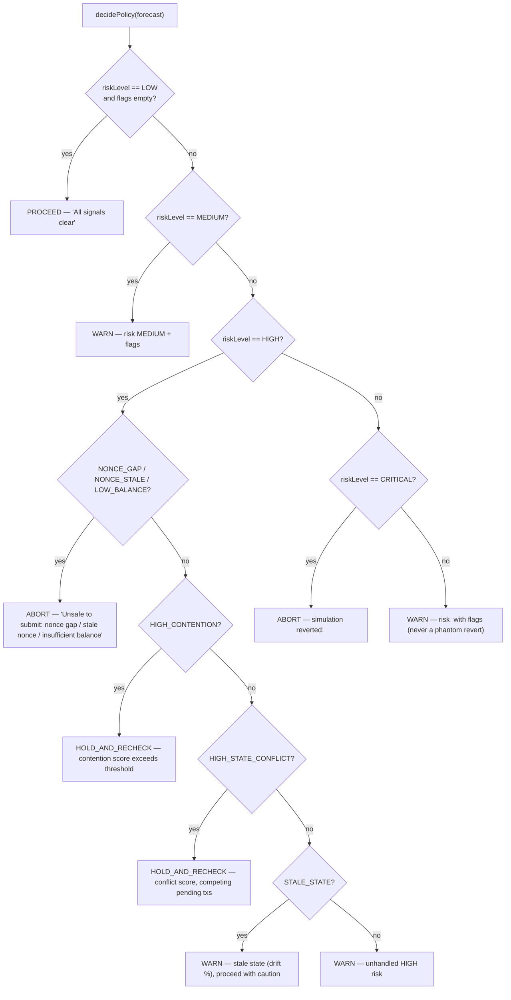

**Every branch explained**:

1. **LOW + no flags → PROCEED.** The clean case.
2. **MEDIUM → WARN.** Any MEDIUM forecast warns, listing its flags.
3. **HIGH + nonce/balance flags → ABORT.** Safety failures are absolute and outrank
   everything else at HIGH (holding cannot fix them).
4. **HIGH + HIGH_CONTENTION → HOLD_AND_RECHECK.** The canonical "wait and re-check"
   condition; reason cites the contention score.
5. **HIGH + HIGH_STATE_CONFLICT → HOLD_AND_RECHECK.** The ECA's high conflict reuses the
   same hold loop — waiting is exactly what resolves a crowded mempool. Nonce ABORTs
   checked above keep precedence.
6. **HIGH + STALE_STATE → WARN** (not HOLD) — see Section 6 for the rationale.
7. **HIGH + anything else → WARN** ("Unhandled HIGH risk") — a safe fallback.
8. **CRITICAL → ABORT** — simulation reverted; reason carries the revert reason.
9. **Everything else → WARN** — in practice a LOW forecast carrying flags. The source
   comment notes this used to fall through to the CRITICAL tail and abort a clean
   transaction while inventing a phantom revert; it now warns on the actual flags.

Two wrappers in the same file:

- `applyWatchdogBias(result, activeCriticalAlerts)` — with active critical alerts,
  PROCEED becomes WARN and every action's reason is annotated; otherwise unchanged.
- `holdAndRecheck(tx, quotedOutput, {intervalMs=3000, timeoutMs=30000})` — polls
  `getPSGForecast` until the action resolves away from HOLD_AND_RECHECK, or returns
  `SUGGEST_ADJUSTMENT` ("try increasing gas or waiting") on timeout, paired with the
  freshest forecast it managed to get. Never throws.

---

## Section 11 — Ledger (Execution Memory)

- **Engine**: SQLite via `better-sqlite3`, WAL journal, schema in
  `backend/src/em/schema.sql`, opened once at server start by `initDatabase`
  (`server.ts` — fatal if it fails: a health-check-passing-but-not-recording service is
  worse than down).
- **`recordEntry(entry)`** (`em/ledger.ts`): inserts an immutable audit row — `id` (uuid),
  `tx_from`, `tx_to`, `tx_data`, `tx_value`, **`forecast_json`** (the full serialized
  `PSGForecast`, including conflict evidence), `policy_action`, `policy_reason`,
  `explanation`, nullable `user_action`/`outcome`/`tx_hash`, server-side `created_at`.
  Fully parameterized SQL; returns the generated id.
- **`forecast_json`** is the audit payload: every signal, every count, the ECA evidence
  snapshot, the risk level. It is *not* returned by `GET /api/ledger` — only `riskLevel`
  is projected out per row (the blob is multi-KB).
- **Audit persistence**: rows are immutable (only `user_action`, `outcome`, `tx_hash` are
  ever updated, via `updateOutcome`'s `COALESCE` semantics). `GET /api/ledger` pages
  newest-first with clamped limit/offset; `GET /api/stats` aggregates by action/outcome
  plus an `overridden` count.
- **Transaction history**: `updateOutcome` attaches what the user did (SIGNED /
  CANCELLED / OVERRIDDEN) and what actually happened (CONFIRMED / FAILED / DROPPED /
  STUCK) to the same entry. `POST /api/outcome` triggers `recalibrate(tx_to)`.
- **What gets stored**: the full forecast, the policy, the explanation, the user action,
  the outcome, the tx hash, the timestamp.
- **What doesn't get stored**: nothing client-supplied for timestamps (server-side only);
  the ledger API never returns `forecast_json`; dismissed alerts are hidden but never
  deleted (dismissed = 1 rows remain).

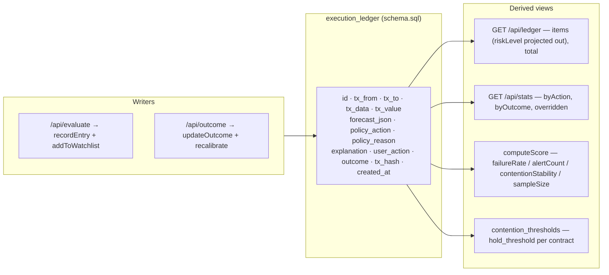

---

## Section 12 — Recheck Loop

The Guard console polls `/api/recheck` every 10 seconds while a verdict is on screen and
the user hasn't acted (`useVerdictRecheck`, `RECHECK_POLL_MS = 10_000` in
`frontend/src/hooks/api/index.ts`). The backend re-verifies the *same* transaction against
fresh chain state and returns a fresh verdict — never a new audit event (the ledger row is
only read).

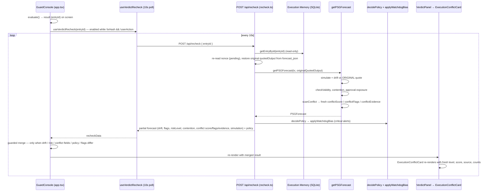

- **10-second polling**: `RECHECK_POLL_MS = 10_000`; the hook is disabled once the user
  signs, cancels, or edits the transaction (`recheckEntryId` becomes undefined).
  `placeholderData` keeps the previous verdict visible while a recheck is in flight.
- **Synchronization**: the merge effect in `app.tsx` spreads the recheck's partial
  forecast over the original response and replaces `policy`, guarded by value
  comparisons so a no-op recheck doesn't create a new state object every 10s. The ECA's
  `conflictFlags` and `conflictEvidence` are compared by value (JSON), so a recheck that
  only re-scanned the mempool (same score, flipped source, different counts) still merges.
- **HOLD timeout**: `HOLD_AND_RECHECK` inside `/api/evaluate` is resolved server-side by
  `holdAndRecheck` (3s interval, 30s timeout) *before* the response returns; the recheck
  route deliberately has no hold loop — a high-contention recheck simply reports the fresh
  "Holding" decision as-is.
- **Recheck transitions**: any drift, risk, policy, or conflict change during the 10s
  poll flows into the panel automatically — WARN → HOLD, HOLD → PROCEED, HOLD → ABORT,
  WARN → PROCEED, conflict NONE → HIGH → NONE, MEMPOOL VIEW → LOG-DENSITY ESTIMATE, and
  score/evidence-count changes all propagate through the same merged result state.

---

## Section 13 — Frontend Architecture

**Guard console route** (`frontend/src/routes/app.tsx`) owns the state machine: preset
selection, `useTxBuilder` build, `useEvaluate` mutation, the recheck merge, `useSendTransaction`
signing (with the *evaluated* nonce), outcome reporting (`useReportOutcome` on terminal
watch status), and the `WatcherStrip`.

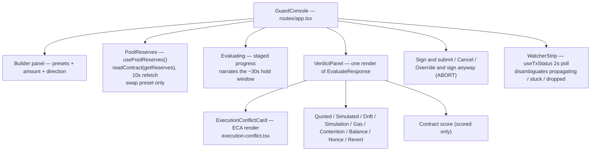

**Every Guard console card**:

| Card | Data source | Rendering logic | Recheck updates |
|---|---|---|---|
| **Pool Reserves** (`pool-reserves.tsx`) | Direct chain read (`usePoolReserves`, `getReserves`), 10s refetch | Two reserve fields; `formatToken` renders "—" for null/loading/RPC failure | Independent 10s poll; not part of the verdict merge |
| **State Drift** (`verdict-panel.tsx`) | `forecast.outputDriftPercent` (signed, backend) | Direction/colour from `driftDirection(drift)`; shows for both swap directions | Re-renders from merged drift; status STALE_STATE when flag present |
| **Execution Conflict** (`execution-conflict.tsx`) | `forecast.conflictScore` / `conflictFlags` / `conflictEvidence` | Three-state segmented display (NONE/POTENTIAL/HIGH) from backend flags; score as a plain number (never a meter); source label verbatim (`pending-block`→"MEMPOOL VIEW", `logs-fallback`→"LOG-DENSITY ESTIMATE"); evidence chips hidden at zero; explanation from `explainConflict` (backend counts only). Renders nothing when `conflictEvidence` is absent | Merge keeps score/flags/evidence in lockstep from the same scan, so level, score, source and counts always agree |
| **Status** (`verdict-panel.tsx`) | `flags` + `outputDriftPercent` | "STALE_STATE" when flag present, else "Current" | Flag set merges → status flips live |
| **Decision** (`verdict-panel.tsx`) | `policy.action` + `policy.reason` + `suggestedAdjustment` | `actionLabel`/`actionTone` badge, reason text, optional adjustment in caution colour | `policy` is replaced wholesale on merge → any transition (WARN→HOLD, HOLD→PROCEED, …) renders immediately |
| **Quoted Output** (`verdict-panel.tsx` Field) | `forecast.quotedOutput` | `formatToken` (wei-scale, "—" for null) | Not sent by recheck — stays at evaluate-time value |
| **Simulated Output** (`verdict-panel.tsx` Field) | `forecast.simulatedOutput` | `formatToken`; tone follows policy action when drift present | Re-sent by recheck → updates |
| **Gas** (`verdict-panel.tsx` Field) | `forecast.gasEstimate` | `formatGas` (BigInt → locale string) | Not sent by recheck — stays |
| **Nonce** (`verdict-panel.tsx` Field) | `forecast.nonceIssue` / `nonceCurrent` | "STALE"/"GAP" in danger tone, "Current", or "—" | Only via flags (NONCE_*); raw fields not re-sent |
| **Contract Score** (`verdict-panel.tsx`) | `forecast.score` (`computeScore` result) | Big number with `scoreTone`, breakdown sample-size caption; only when `scored: true` | Not re-sent by recheck — stays until next evaluate |
| **In Plain English** (`verdict-panel.tsx`) | `explanation` from `explainPolicy` (AI or deterministic template) | Sparkles-labelled block — the one AI component, explicitly labelled | Not re-sent by recheck — stays (policy `reason` does refresh) |

Supporting layers: `lib/api` (one function per endpoint, `apiFetch` with timeouts —
evaluate gets a long timeout for the hold window), `hooks/api` (TanStack Query bindings
with cadences matched to server behavior: alerts 10s, stats 15s, tx status 2s, recheck
10s), `lib/risk.ts` (single source of truth for tones, labels, drift direction, conflict
level mapping, flag descriptions, `explainConflict`), `lib/format.ts` (wei-safe token
formatting, signed percents, gas, relative time), `lib/api/normalize.ts` (snake_case
SQLite rows → camelCase).

---

## Section 14 — State Machines

**Transaction / policy state** (from `decidePolicy`, `PolicyAction`):

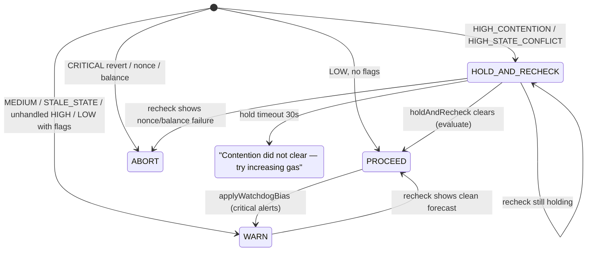

**Execution conflict state** (from `conflictFlagsFor` / `conflictLevel`):

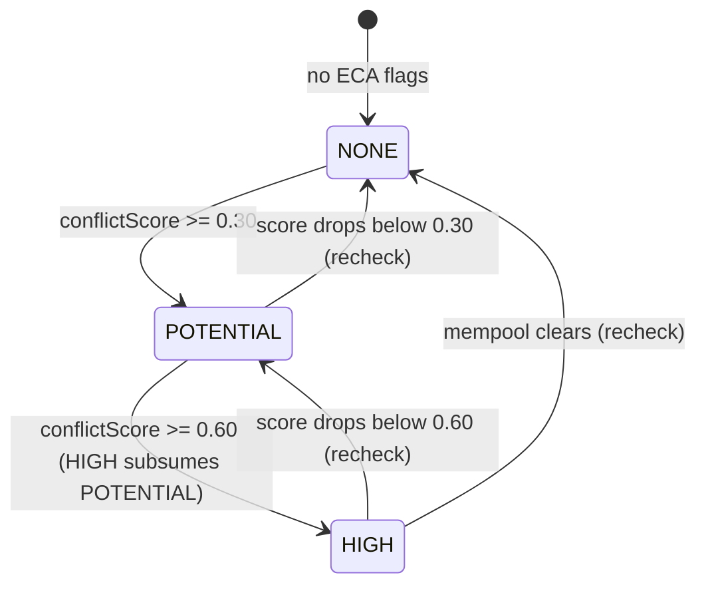

**Drift state**:

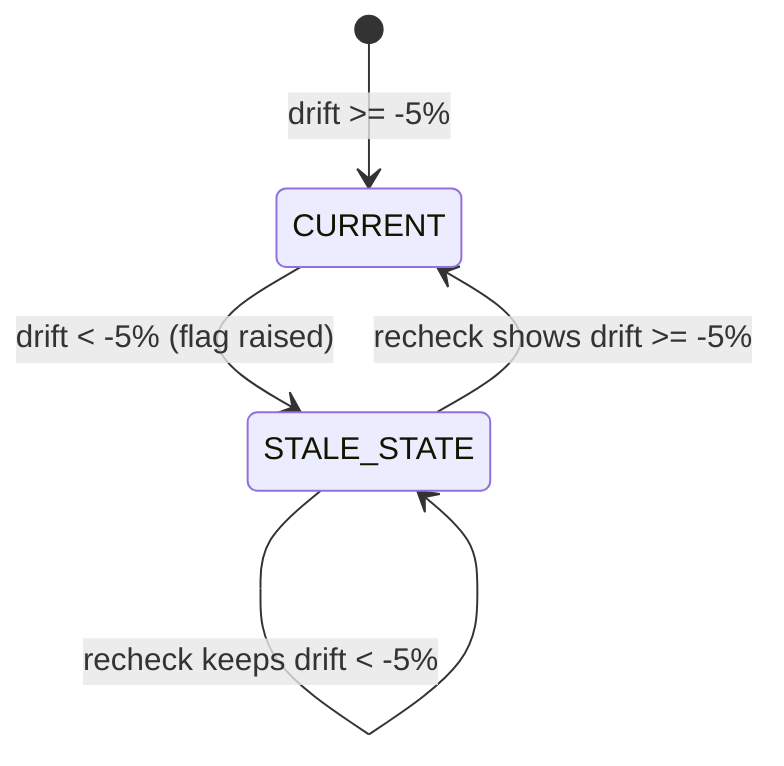

**Transaction watcher state** (from `classifyTx` / `watchTransaction`,
`TxWatchStatus`):

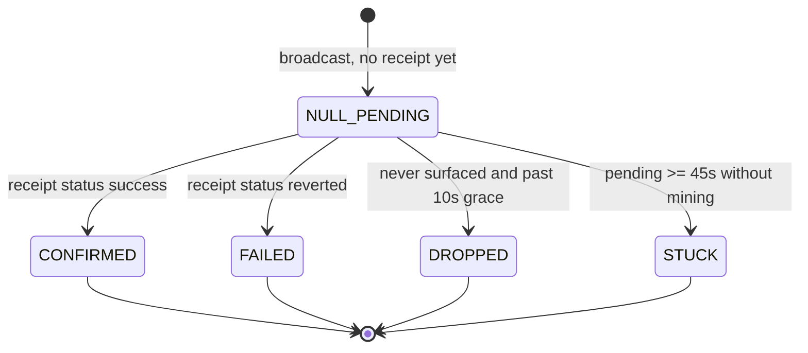

---

## Section 15 — Monad-Specific Architecture

| Monad problem | VANTAGE solution | Where implemented |
|---|---|---|
| **Deferred execution** — a tx isn't executed at broadcast; effects land later, so a null receipt is ambiguous | `watchTransaction` / `classifyTx` disambiguate "propagating" (NULL_PENDING), "stuck" (≥ 45s pending), and "dropped" (gone past a 10s never-seen grace), each with a distinct recommendation; "not known" is never treated as "dropped" | `backend/src/apa/policy.ts` (watcher section) |
| **Parallel execution** — multiple txs race the same contract in one block | ECA enumerates the pending block and counts viable, other-sender competitors (same-contract, competing swaps, pool writers, same-slot claims) into a 0–1 `conflictScore` with a severity ladder; `HIGH_STATE_CONFLICT` → HOLD_AND_RECHECK | `backend/src/psg/forecast.ts` (ECA) |
| **Optimistic concurrency control (OCC)** — conflicts cause re-execution, so outcomes depend on what else is in flight | The ECA is explicitly *contract-level, evidence-based*: it never claims true conflict detection or OCC reconstruction, but surfaces competing-tx pressure the user cannot see from a single simulation; the recheck loop re-scans the mempool every 10s so the verdict tracks the live race | `forecast.ts` (ECA comments), `routes/recheck.ts`, `hooks/api/index.ts` |
| **Block conflicts / contention** — hot contracts degrade execution reliability | `getContentionScore` (log density over a ~3-minute window, chunked ≤100-block `eth_getLogs` to respect the RPC cap) → `HIGH_CONTENTION` → calibrated-threshold HOLD; contention also feeds the contract score | `forecast.ts`, `em/calibrator.ts`, `services/scoring.ts` |
| **Execution gaps** — state between quote and execution | Drift analysis compares the *original* quote against a fresh simulation (`outputDriftPercent`), flagging `STALE_STATE` at < −5% and re-verifying on every recheck | `forecast.ts` (`computeDriftPercent`), `routes/recheck.ts` |
| **State ambiguity** — a tx can silently fail after appearing accepted | Post-submission watcher re-runs a reverted tx as `eth_call` pinned to the failing block to extract the *real* revert reason (state changes after cannot mask it); outcome is recorded back to the ledger and recalibrates the contract | `policy.ts` (`extractRevertReason`), `em/ledger.ts` |

The README frames the same mapping at product level: Monad's optimistic parallel
execution, deferred execution, and asynchronous lifecycle are the *reason* single-snapshot
wallet simulation is insufficient, and each VANTAGE subsystem is designed around them
rather than treating Monad as a generic EVM chain.

---

## Section 16 — Startup Thesis

**Why this is infrastructure rather than a DeFi product.** VANTAGE sells *execution
intelligence*, not a trading surface: it analyzes, decides, monitors, and learns
("Analyze. Decide. Monitor. Learn." — README tagline) about any contract, without holding
funds, routing orders, or taking a position. It is the safety/observation layer beneath
other products' transactions — the README's "Why Vantage?" and "The Problem" sections
frame it as the answer to a question wallets don't ask ("should this execute right now?"),
positioned *under* the wallet/trader/app layer rather than competing with it.

**Target users** (README "Key Capabilities" + the five-module architecture):

- **Wallets** — pre-sign guard as an execution advisor: simulation, drift, nonce, balance,
  approval exposure, and conflict surfaced before signing.
- **DeFi traders** — live state-drift and contention visibility so a swap executes at the
  price it was quoted, with HOLD_AND_RECHECK guidance when the mempool is crowded.
- **Aggregators** — a deterministic, explainable decision layer over the execution
  conditions their routes depend on.
- **RWA applications** — continuous monitoring (watchdog) and a transparent contract trust
  score for contracts whose reliability matters beyond a single tx.
- **Infrastructure providers** — the execution-intelligence ledger and calibration loop
  turn recorded outcomes into per-contract thresholds and scores that improve over time.

**Why VANTAGE becomes more valuable as Monad throughput increases.** Every mechanism in
the pipeline is about *competition for state*: contention scoring measures how busy a
contract is, the ECA counts who else is racing it, drift measures how far the chain moved
between quote and execution, and the calibrated hold threshold adapts to real failure
rates. Higher throughput means more parallel transactions, denser mempools, more
same-slot/same-pool races, and more state movement between simulation and inclusion — the
exact conditions the ECA, contention scanner, drift check, recheck loop, and calibrator
exist to measure. The more execution pressure Monad produces, the more valuable an
independent, evidence-backed answer to *"should this execute right now?"* becomes.

---

## Verified Files Examined

Backend (`vantage/backend/src`):

- `apa/policy.ts` — decidePolicy, applyWatchdogBias, holdAndRecheck, watchTransaction, classifyTx, explainPolicy, templateExplain
- `psg/forecast.ts` — getForecast, computeDriftPercent, checkValidity, getContentionScore, getRecentActivity, checkApprovalExposure, ECA (scanConflict, analyzePendingTxs, fallbackConflict, conflictFlagsFor, isViablePendingTx), deriveRiskLevel, getPSGForecast
- `psg/conflict.test.ts` — pinned ECA v3 formulas and thresholds
- `psg/conflict-rpc.test.ts`, `psg/forecast.test.ts` — ECA/forecast test coverage
- `routes/evaluate.ts` — request validation, PSG aggregation, hold loop, watchdog bias, explain, record, auto-watch, score, response
- `routes/recheck.ts` — recheck payload (incl. conflictScore/conflictFlags/conflictEvidence), original-quote drift
- `routes/outcome.ts` — userAction/outcome update + recalibrate
- `routes/score.ts` — GET /api/score/:address → computeScore
- `routes/stats.ts` — GET /api/stats → getSessionStats
- `routes/ledger.ts` — GET /api/ledger (paged, riskLevel projected)
- `routes/watch.ts` — GET /api/watch/:txHash → classifyTx (since-window validation)
- `routes/watchlist.ts` — watchlist + alerts CRUD + summary
- `routes/recheck.test.ts`, `routes/score.test.ts`, `routes/mount.test.ts`, `routes/ledger-watch.test.ts` — route-level tests
- `em/ledger.ts` — initDatabase, recordEntry, updateOutcome, getSessionStats, getEntriesForContract, getEntryById, countEvaluations, getRecentEntries, getThresholdRow, upsertThreshold, watchlist/alerts functions, getActiveCriticalAlertCount, getAlertSummary
- `em/schema.sql` — execution_ledger, contention_thresholds, watchlist, alerts, indexes
- `em/calibrator.ts` — DEFAULT_HOLD_THRESHOLD, getThreshold, recalibrate
- `em/ledger.test.ts`, `em/schema-asset.test.ts`, `em/alert-lifecycle.test.ts`, `em/address-case.test.ts` — EM tests
- `services/scoring.ts` — computeScore, ScoreBreakdown, weights
- `services/watchdog.ts` — startWatchdog, pollAll, pollContract, compareSnapshots, checkApprovalExposure, alert thresholds, recalibrate cooldown
- `services/scoring.test.ts` — scoring tests
- `server.ts` — app assembly, route mounting, health, terminal error handler, watchdog start
- `config.ts` — port, rpcUrl, chainId, databasePath, openaiApiKey

Frontend (`vantage/frontend/src`):

- `routes/app.tsx` — GuardConsole state machine, recheck merge guard, signing, outcome reporting
- `routes/monitor.tsx` — watchlist + alert feed UI
- `routes/score.tsx` — Vantage Score dashboard (penalty breakdown)
- `hooks/useTxBuilder.ts` — presets, nonce fetch, live quote, encodeFunctionData
- `hooks/usePoolReserves.ts` — 10s reserve poll
- `hooks/api/index.ts` — TanStack Query hooks; poll cadences (alerts 10s, stats 15s, tx 2s, recheck 10s); query keys
- `lib/api/index.ts` — one function per endpoint, apiFetch, timeouts
- `lib/api/types.ts` — wire + app types (incl. ConflictFlag/ConflictEvidence, RecheckResult)
- `lib/api/normalize.ts` — snake_case rows → camelCase
- `lib/api/client.ts` — apiFetch, qs, EVALUATE_TIMEOUT_MS, ApiError
- `lib/risk.ts` — tones, labels, driftDirection, conflictLevel, explainConflict, flagDescription, watchStatusLabel
- `lib/format.ts` — shortAddress, formatToken, formatPercent/formatDriftPercent, formatGas, relativeTime
- `components/guard/verdict-panel.tsx` — the verdict panel with all cards
- `components/guard/execution-conflict.tsx` — the ECA card
- `components/guard/pool-reserves.tsx` — reserves card
- `components/guard/evaluating.tsx` — staged progress during the hold window
- `components/guard/watcher-strip.tsx` — post-submission status strip
- `components/guard/execution-conflict.test.tsx`, `components/guard/verdict-panel.test.tsx`, `components/guard/pool-reserves.test.tsx` — component tests
- `config/contracts.ts` — deployed addresses + ABIs from `contracts/deployments.json`
- `components/dashboard-grid.tsx`, `components/app-shell.tsx`, `components/wallet-button.tsx`, `components/spotlight-card.tsx`, `components/Beams.tsx`, `components/parametric-mesh.tsx`, `components/page-header.tsx`, `components/data-source-badge.tsx`, `components/backgrounds/*` — layout/shell components

Repo-level:

- `README.md` — product framing, five-module overview, Monad rationale
- `Commands.md` — score formula, contention formula, deployment commands
- `contracts/deployments.json` — deployed addresses
- `frontend/package.json`, `frontend/vitest.config.ts`, `frontend/src/setupTests.ts`, `frontend/.prettierrc`, `frontend/eslint.config.js` — tooling

## Untouched Files

No source file was modified, refactored, or generated for this document. In particular,
the following were read only and are unchanged:

- All backend files under `vantage/backend/src/` (policy, forecast, routes, em, services, config, server)
- All backend tests under `vantage/backend/src/`
- All frontend files under `vantage/frontend/src/` (routes, hooks, lib, components, config)
- All frontend tests under `vantage/frontend/src/`
- `vantage/README.md`, `vantage/Commands.md`, `vantage/contracts/deployments.json`
- Frontend tooling configs (`package.json`, `vitest.config.ts`, `setupTests.ts`, `.prettierrc`, `eslint.config.js`)

The only file created by this task is this one: `ARCHITECTURE.md`. No commits were made.
