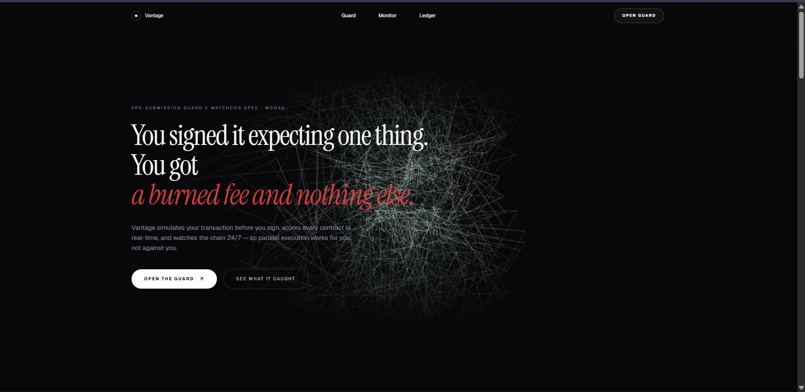
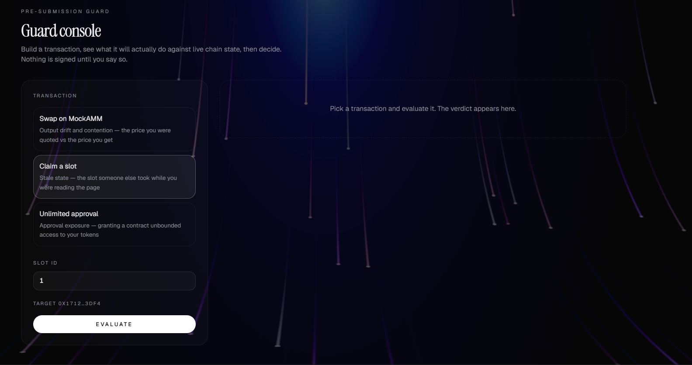
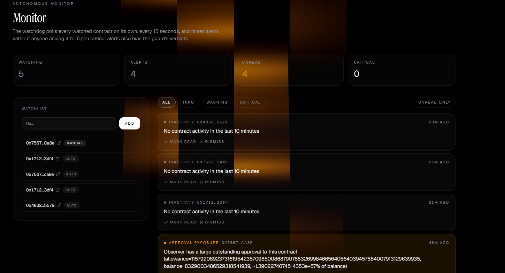
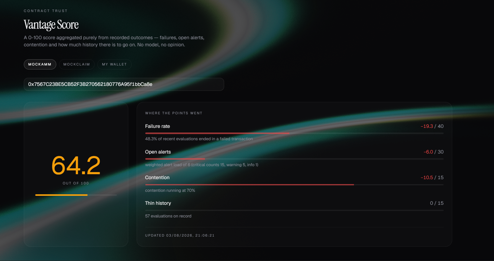

<div align="center">

#  Vantage

### Autonomous Transaction Intelligence for the Monad Ecosystem

*Analyze. Decide. Monitor. Learn.*

---

[]()
---

### 🌐 Live Demo

**🔗 Website:**  
> **vantage-two-iota.vercel.app**


</div>

---

# Screenshots

## Landing Page



---

## Pre-Sign Guard Console



---

## Autonomous Watchdog



---

## Contract Trust Dashboard



---

# Overview

Vantage is an autonomous transaction intelligence platform designed specifically for the Monad ecosystem.

Instead of stopping at transaction simulation or static warnings, Vantage continuously evaluates execution conditions before, during, and after a transaction. It combines deterministic blockchain analysis with an explainable policy engine to help users make safer execution decisions while remaining fully transparent about how every recommendation is produced.

Every recommendation generated by Vantage is grounded in verifiable blockchain evidence. Artificial intelligence is used only to reason over deterministic signals and communicate recommendations—it never invents blockchain state, computes hidden risk scores, or replaces deterministic execution analysis.

---

# Why Vantage?

Monad introduces a fundamentally different execution model compared to traditional EVM chains.

Its optimistic parallel execution, deferred execution model, and asynchronous transaction lifecycle significantly improve throughput, but they also introduce execution behaviors that existing transaction safety tools were not originally designed to handle.

Developers and users frequently rely on transaction simulation or wallet warnings that capture only a single snapshot of the blockchain.

Between simulation and execution, however, the blockchain may change.

Liquidity may move.

NFT ownership may change.

Contract state may be updated.

Execution contention may increase.

Approvals may expose unnecessary token permissions.

Transactions may silently fail after appearing to be accepted.

Vantage continuously analyzes these execution conditions and transforms them into actionable recommendations before a user commits to signing a transaction.

---

# The Problem

Modern wallets answer only one question:

> **"Will this transaction probably execute?"**

Vantage answers a much more useful question:

> **"Should this transaction be executed right now?"**

That distinction is the foundation of the platform.

Rather than providing isolated warnings, Vantage continuously gathers execution intelligence, evaluates current network conditions, monitors historical contract behavior, and produces explainable execution policies supported by deterministic blockchain evidence.

---

# Key Capabilities

##  Deterministic Pre-Sign Analysis

Before a transaction is signed, Vantage performs deterministic blockchain analysis to detect execution risks including:

- Transaction simulation
- State drift detection
- Transaction health validation
- Contention analysis
- Approval exposure analysis
- Historical contract reputation

---

##  Explainable Policy Engine

Instead of asking users to interpret raw execution data, Vantage converts verified blockchain signals into clear execution recommendations.

Possible recommendations include:

-  Proceed
-  Wait
-  Hold & Re-check
-  Adjust Execution Parameters
-  Cancel Transaction

Every recommendation is accompanied by an explanation referencing the exact blockchain signals that produced it.

---

##  Autonomous Watchdog

Vantage continues working even when the user is not actively interacting with the application.

The Watchdog continuously monitors watched contracts by:

- Polling contract activity
- Tracking execution health
- Detecting inactivity
- Monitoring approval exposure
- Raising real-time alerts
- Feeding observations into future evaluations

---

##  Execution Intelligence

Every evaluation performed by Vantage contributes to a growing body of execution intelligence.

The platform continuously records:

- Successful executions
- Failed executions
- State conflicts
- Approval events
- Network contention
- User overrides
- Alert history
- Execution outcomes

Rather than simply storing logs, Vantage transforms historical execution evidence into continuously improving decision support.

---

##  Contract Trust Engine

Vantage assigns every monitored contract a transparent Trust Score derived entirely from historical execution evidence.

Unlike opaque reputation systems, every point gained or lost can be traced back to measurable execution outcomes such as:

- Historical failure rate
- Active security alerts
- Network contention
- Available execution history

This allows developers and users to evaluate not only a single transaction, but also the long-term operational reliability of the contracts they interact with.

---

# Core Principles

Vantage is built around five engineering principles.

### Deterministic First

Blockchain state is always the source of truth.

---

### Explainable Intelligence

Artificial intelligence explains decisions—it never invents facts.

---

### Continuous Monitoring

Execution conditions continue changing after simulation.

Vantage continues observing them.

---

### Evidence Over Assumptions

Every recommendation is backed by measurable blockchain evidence.

---

### Monad Native

Every subsystem is designed specifically around Monad's execution architecture rather than treating Monad like another generic EVM chain.

# System Architecture

Vantage is organized into five independent yet interconnected subsystems.

Each subsystem has a clearly defined responsibility and communicates with the next through explicit outputs rather than hidden state. This separation keeps the platform modular, explainable, and extensible while ensuring that artificial intelligence never replaces deterministic blockchain analysis.

```
                    User Transaction
                           │
                           ▼
┌─────────────────────────────────────────────────────┐
│                                                     │
│        Module I – Pre-Sign Guard System             │
│             Deterministic Analysis                  │
│                                                     │
└──────────────────────┬──────────────────────────────┘
                       │
                       ▼
┌─────────────────────────────────────────────────────┐
│                                                     │
│     Module II – Autonomous Policy Agent             │
│        Explainable Decision Engine                  │
│                                                     │
└──────────────────────┬──────────────────────────────┘
                       │
                       ▼
┌─────────────────────────────────────────────────────┐
│                                                     │
│     Module III – Autonomous Watchdog               │
│        Continuous Contract Monitoring               │
│                                                     │
└──────────────────────┬──────────────────────────────┘
                       │
                       ▼
┌─────────────────────────────────────────────────────┐
│                                                     │
│      Module IV – Execution Intelligence             │
│     Historical Outcomes & Continuous Learning       │
│                                                     │
└──────────────────────┬──────────────────────────────┘
                       │
                       ▼
┌─────────────────────────────────────────────────────┐
│                                                     │
│        Module V – Contract Trust Engine             │
│      Transparent Reputation & Risk Scoring          │
│                                                     │
└──────────────────────┬──────────────────────────────┘
                       │
                       └───────────────► Future Evaluations
```

---

# Module I — Pre-Sign Guard System (PSGS)

The **Pre-Sign Guard System (PSGS)** is the deterministic foundation of Vantage.

Before a transaction is signed, PSGS gathers execution intelligence directly from the blockchain and surrounding execution environment. It does not make decisions or produce recommendations. Instead, it transforms raw blockchain state into structured evidence for downstream reasoning.

All outputs generated by PSGS are deterministic, reproducible, and independently verifiable.

---

## Execution Forecast Agent

The Execution Forecast Agent predicts how the transaction will execute under the current blockchain state.

It performs:

- Transaction simulation
- Revert prediction
- Expected execution result
- Output comparison against quoted values
- Gas estimation

Its objective is to answer:

> **"What will happen if this transaction executes right now?"**

---

## Transaction Health Agent

Even a correctly constructed transaction may fail due to execution conditions.

The Transaction Health Agent validates:

- Account balance
- Nonce correctness
- Gas affordability
- Deferred execution risks
- Transaction propagation status

This prevents failures that are not visible from simulation alone.

---

## State Conflict Agent

Blockchain state can change between the moment a user prepares a transaction and the moment it is signed.

The State Conflict Agent detects changes including:

- Liquidity updates
- NFT ownership changes
- Contract storage modifications
- State drift
- Invalidated execution assumptions

Whenever execution assumptions become stale, PSGS automatically invalidates previous simulations and requests a fresh evaluation.

---

## Contention Intelligence Agent

Monad enables parallel transaction execution.

As network demand increases, multiple transactions may compete for access to the same contracts.

The Contention Intelligence Agent measures:

- Contract activity
- Concurrent execution pressure
- Contention level
- Estimated execution conflicts
- Hot contract detection

These signals help determine whether execution conditions remain favorable.

---

## Approval Security Agent

Token approvals remain one of the largest attack surfaces in decentralized applications.

The Approval Security Agent analyzes every approval transaction before execution.

It detects:

- Unlimited approvals
- Excessive allowances
- Existing approval exposure
- Suspicious spender contracts
- Approval reuse
- Redundant approval requests

Whenever possible, Vantage recommends granting only the permissions actually required for execution.

---

# Module II — Autonomous Policy Agent (APA)

Once deterministic analysis has been completed, all verified execution signals are forwarded to the Autonomous Policy Agent.

The Policy Agent does **not** perform blockchain analysis itself.

Instead, it reasons exclusively over structured evidence produced by PSGS.

Its responsibility is to convert technical execution data into actionable recommendations while remaining fully explainable.

---

## Responsibilities

The Policy Agent may recommend:

-  Proceed
-  Wait
-  Hold & Re-check
-  Retry under improved conditions
-  Cancel execution

Every recommendation is accompanied by a human-readable explanation describing exactly which deterministic signals influenced the decision.

---

## Explainability Engine

Blockchain execution data is often difficult for users to interpret.

Rather than exposing simulation traces and raw execution metrics, Vantage includes an Explainability Engine that transforms deterministic outputs into concise natural-language explanations.

The Explainability Engine:

- Never computes risk
- Never invents blockchain state
- Never introduces unsupported claims
- Never overrides deterministic analysis

Its sole purpose is to improve communication while preserving transparency.

---

## Continuous Re-evaluation

Execution environments evolve continuously.

Before final confirmation, the Policy Agent may request PSGS to perform another deterministic evaluation if important execution signals have changed.

This prevents users from executing transactions based on outdated assumptions.

---

# Artificial Intelligence Boundaries

Artificial intelligence inside Vantage is intentionally constrained.

AI is **not** responsible for:

- Blockchain simulation
- Risk scoring
- State inspection
- Transaction validation
- Reputation calculation

Instead, AI is responsible only for:

- Policy reasoning
- Recommendation generation
- Natural-language explanations

Every numerical score, warning, alert, and execution signal originates from deterministic blockchain analysis.

This design ensures that execution recommendations remain transparent, reproducible, and auditable.
# Module III — Autonomous Watchdog

Transaction safety does not end once a transaction has been analyzed.

Blockchain state continues evolving every second.

Liquidity changes.

Contract activity changes.

Approval exposure changes.

Execution contention rises and falls.

For this reason, Vantage includes an **Autonomous Watchdog**, a continuous monitoring subsystem responsible for observing contracts beyond a single transaction lifecycle.

Rather than operating only when a user presses **"Analyze"**, the Watchdog continuously evaluates monitored contracts and records meaningful changes that may influence future execution decisions.

---

## Responsibilities

The Watchdog continuously performs:

- Contract activity monitoring
- Periodic execution health checks
- Failure detection
- Approval exposure monitoring
- Contention monitoring
- Alert generation
- Historical observation recording

This allows Vantage to detect emerging risks long before the next transaction is initiated.

---

## Continuous Monitoring

Users may subscribe contracts to the Watchdog.

Once added, Vantage periodically evaluates the monitored contract and records execution observations over time.

These observations include:

- Execution failures
- Repeated reverts
- Approval anomalies
- Persistent contention
- Extended inactivity
- Health degradation
- Alert history

Unlike traditional monitoring dashboards that simply display metrics, the Watchdog actively contributes intelligence to future execution decisions.

---

## Alert Engine

Whenever predefined execution policies are violated, the Watchdog generates transparent alerts.

Examples include:

- High transaction failure rates
- Excessive approval exposure
- Persistent execution contention
- Contract inactivity
- Unexpected execution behaviour

Alerts are categorized by severity, allowing users to quickly identify contracts requiring attention.

Every alert contributes to the contract's historical execution profile.

---

# Module IV — Execution Intelligence Engine

Execution Intelligence is the historical memory of Vantage.

Rather than storing blockchain logs for archival purposes, this subsystem continuously aggregates execution evidence and transforms it into structured operational intelligence.

Every transaction analyzed by Vantage expands the platform's understanding of contract behaviour.

---

## Historical Knowledge

The Execution Intelligence Engine records:

- Successful executions
- Failed executions
- Execution latency
- Contention history
- Approval history
- Alert history
- User overrides
- Previous recommendations
- Final execution outcomes

Over time, these observations form an evolving execution profile for every monitored contract.

---

## Continuous Learning

Execution Intelligence allows Vantage to answer questions such as:

- Has this contract failed frequently in the past?
- Has execution quality improved recently?
- Is contention increasing?
- Are alerts becoming more severe?
- Is this contract becoming less reliable over time?

Unlike machine learning systems that continuously modify hidden parameters, Vantage maintains complete transparency by learning only from deterministic execution evidence.

---

## Why Historical Context Matters

A transaction may appear perfectly safe when viewed in isolation.

However, historical execution evidence may reveal patterns such as:

- Frequent execution failures
- Recurring approval risks
- Increasing contention
- Persistent operational instability

Historical context enables more informed recommendations without sacrificing explainability.

---

# Module V — Contract Trust Engine

The Contract Trust Engine transforms historical execution evidence into a transparent reputation score.

Rather than assigning arbitrary trust values, every score is computed using measurable operational data collected by the Execution Intelligence Engine.

The objective is not to predict future behaviour, but to summarize historical reliability in a way that is immediately understandable.

---

## Trust Score

Each monitored contract receives a continuously updated **Trust Score** ranging from **0 to 100**.

Higher scores indicate stronger historical operational reliability.

Lower scores indicate increasing execution risk based on recorded evidence.

The Trust Score is recalculated whenever new execution evidence becomes available.

---

## Scoring Factors

The score is derived from deterministic execution metrics, including:

- Historical transaction failure rate
- Active security alerts
- Network contention
- Amount of historical execution data
- Approval exposure history

Every deduction is transparent and directly attributable to recorded observations.

No hidden heuristics or AI-generated reputation values are used.

---

## Transparent Score Breakdown

Unlike traditional reputation systems, Vantage explains every score.

Users can see:

- Current Trust Score
- Individual scoring factors
- Historical deductions
- Alert contributions
- Contention penalties
- Failure penalties

Every point gained or lost can be traced back to observable blockchain behaviour.

---

# Continuous Feedback Loop

The true strength of Vantage lies in its closed feedback architecture.

Rather than treating each transaction independently, every subsystem continuously improves future evaluations through accumulated execution evidence.

```

                 Transaction
                       │
                       ▼
        Pre-Sign Guard System
                       │
                       ▼
        Autonomous Policy Agent
                       │
                       ▼
        Autonomous Watchdog
                       │
                       ▼
     Execution Intelligence Engine
                       │
                       ▼
        Contract Trust Engine
                       │
                       ▼
      Future Transaction Evaluations

```

Each completed transaction enriches the platform's historical understanding, allowing future recommendations to benefit from previous execution outcomes while remaining fully deterministic and explainable.

---

# Design Philosophy

Vantage is built upon five fundamental engineering principles.

---

## Deterministic Before Intelligent

Blockchain state is the single source of truth.

Artificial intelligence never replaces deterministic analysis.

---

## Explainability Over Black Boxes

Every recommendation can be traced back to verifiable blockchain evidence.

Users never receive unexplained scores or opaque risk assessments.

---

## Continuous Awareness

Execution conditions evolve continuously.

Monitoring should not stop after simulation.

---

## Historical Context Matters

Current blockchain state provides only part of the picture.

Historical execution behaviour provides additional context necessary for informed execution decisions.

---

## Built Specifically for Monad

Vantage is designed around Monad's execution architecture.

Rather than adapting tooling originally built for sequential execution environments, every subsystem is designed with Monad's optimistic parallel execution model, deferred execution behaviour, and high-throughput architecture in mind.

# Innovation Highlights

- Built specifically for Monad's optimistic parallel execution model.
- Deterministic-first architecture with AI constrained to policy reasoning and explanations.
- Continuous contract monitoring through the Autonomous Watchdog.
- Historical execution intelligence feeding future recommendations.
- Transparent Contract Trust Engine with explainable score breakdowns.
- Modular architecture separating analysis, decision, monitoring, learning, and reputation.